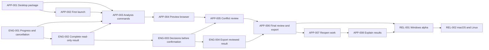

# Desktop App Development Plan

Planning decision: 2026-08-23

This document is the executable product backlog for Foch's player-facing
desktop application. It turns the product workflow into reviewable tasks with
explicit dependencies and completion criteria. The fixed Workshop corpus is a
quality gate for these tasks; running the corpus is not itself a product
feature.

## Product Boundary

Foch will have two user-facing entry points backed by the same Rust engine:

- `foch` remains the command-line interface for automation, advanced users,
  and diagnostics.
- A dedicated desktop application becomes the primary interface for EU4
  players.

The desktop application will use Tauri with a TypeScript frontend. The initial
implementation plan uses React and Vite. The Tauri Rust package must depend
directly on `foch-engine` and `foch-core`; it must not bundle another `foch`
executable, spawn the CLI, scrape terminal output, or consume merge-quality
JSONL as a product API.

The other existing interfaces keep narrower roles:

- The VS Code extension remains a mod-authoring and language-analysis tool.
- The terminal conflict resolver remains a fallback for CLI users.
- The merge-quality package remains internal validation infrastructure.

Windows 10/11 x64 is the primary product and acceptance target. macOS and
Linux must share the same frontend and engine code, with platform-specific
Steam, Launcher, path, packaging, and signing behavior isolated in small Rust
adapters.

## Target User Flow

1. Open Foch and verify the detected game, Launcher, and base-data state.
2. Inspect the current Launcher playset and exact enabled-mod order.
3. Start a read-only merge analysis and watch its progress.
4. Browse every safe, deferred, unsupported, and failed result before output.
5. Review genuine conflicts, choose a source or manual result, or defer them.
6. Review the exact output and all remaining omissions.
7. Confirm once, publish transactionally, and follow an accurate Launcher
   enable/disable checklist.
8. Reopen the project later, retaining valid decisions and identifying stale
   ones after input changes.

## Non-Negotiable Behavior

- Preview must not create or replace the requested output directory or alter
  Launcher state.
- Preview must not copy complete Workshop trees into another store or hash all
  Workshop files. Workshop version identity continues to come from the paired
  read-only ACF manifest.
- Confirmation publishes the result the user reviewed. It must not start a
  second semantic merge or discover new semantic choices.
- Input changes between preview and export invalidate the preview before any
  output transaction starts.
- `needs_user_choice`, `unsupported_input`, and `engine_failure` remain
  distinct. Only genuine user choices receive selection controls.
- Defer is a valid default. Safe unrelated content must remain available when
  some units are deferred.
- A partial artifact may be exported for manual repair, but the application
  must not call it safe to activate when disabling the source mods would drop
  withheld content.
- The first implementation reruns the complete read-only analysis after a
  batch of changed decisions. Incremental recomputation is not required.
- The application may create a Launcher mod entry after explicit export, but
  it must not silently modify the active playset.

## Dependency Order

Start `APP-001` and `ENG-001` in parallel. Then run `APP-002` and `ENG-002`
in parallel. `APP-003` and `APP-004` combine those two lines into the first
product checkpoint.

## Milestone 1: Windows Read-Only Product

### APP-001: Add the desktop application package

**Outcome:** the repository can build and package a Windows desktop shell that
links the existing Rust engine.

**Work:**

- Create `apps/foch-desktop` with Tauri, React, TypeScript, and Vite.
- Add the frontend to the Bun workspace and the Tauri Rust package to the Cargo
  workspace.
- Depend directly on `foch-engine` and `foch-core` from the Tauri Rust package.
- Add frontend formatting, lint, type-check, unit-test, and production-build
  gates alongside the normal Rust gates.
- Add a Windows development-package smoke to CI. Public signing is deferred to
  `REL-001`.

**Done when:** Windows CI produces an installable development application, the
window starts successfully, and repository tests prove that the application
does not bundle or spawn the `foch` CLI.

### APP-002: Build first-launch and current-playset UI

**Outcome:** a player can see whether Foch is ready and which mods it will
analyze without using a terminal.

**Work:**

- Reuse existing configuration and workspace APIs to detect Steam, EU4, the
  Paradox user directory, installed base data, and the current
  `dlc_load.json`.
- Show every enabled mod in exact load order with display name, Workshop
  identity and version, dependency information, and descriptor or missing-input
  errors.
- Offer explicit path selection only when discovery fails.
- Do not claim to enumerate every named Launcher playset until that behavior is
  implemented and verified.

**Done when:** a clean Windows user profile can reach a clear ready or blocked
state, inspect the actual current playset, and follow an actionable correction
for every blocked prerequisite.

### ENG-001: Add structured progress and cancellation

**Outcome:** CLI and desktop users receive the same meaningful progress while
long-running work remains cancellable.

**Likely ownership:** `crates/foch-engine/src/merge`, workspace resolution,
base-data loading where relevant, and the CLI progress adapter.

**Work:**

- Replace merge-path `eprintln!`-only progress with callbacks covering
  inventory, workspace resolution, parsing, semantic merge, validation, and
  export.
- Include completed/total counts when available, the current stage, and elapsed
  time without emitting one event per trivial operation.
- Keep a CLI adapter that renders the events as useful logs.
- Add cancellation checks between safe work units. Cancellation before
  publication must leave output and Launcher state unchanged.

**Done when:** focused tests cover ordered events, count and elapsed fields,
cancellation in each stage, and unchanged filesystem state after cancellation.

### ENG-002: Compute the complete merge result without publishing

**Outcome:** confirmation is preceded by the real semantic result rather than
the current path-only plan.

**Likely ownership:** `crates/foch-engine/src/merge/execute.rs`,
`crates/foch-engine/src/merge/output/materialize.rs`, related output helpers,
and merge-report models in `foch-core`.

**Work:**

- Move semantic work currently performed during export into the read-only
  preparation path.
- Retain final generated text, source references for files that will be copied,
  omitted and deferred records, complete conflict views, and report facts.
- Do not load copy-through assets into memory merely to preserve them for
  export. Keep validated source references and copy them only after
  confirmation.
- Complete cross-file and final-output decisions before presenting the result.
- Do not begin an output transaction, create the requested output directory,
  install a Launcher entry, copy complete source trees, or run a full-tree
  integrity audit.

**Done when:** the no-confirm path exposes every final safe, user-choice,
unsupported, and engine-failure result while the requested output and Launcher
state remain absent or byte-identical.

### APP-003: Expose desktop analysis commands

**Outcome:** the TypeScript UI can drive analysis without becoming responsible
for engine state or filesystem behavior.

**Work:**

- Add thin Tauri commands to start and cancel analysis and to query its summary,
  filtered result pages, one result detail, and one conflict detail.
- Keep the prepared result and generated payloads in Rust-owned application
  state. Do not send whole syntax trees or an entire generated mod through IPC.
- Stream `ENG-001` progress through a Tauri channel.
- Validate every path and option at the Rust boundary and expose only the
  filesystem operations required by the product workflow.

**Done when:** command tests cover valid and invalid input, bounded response
payloads, progress, cancellation, and the absence of CLI subprocesses.

### APP-004: Build the read-only preview browser

**Outcome:** a player can understand the complete proposed merge before any
output is written.

**Work:**

- Add Analyze, stage progress, elapsed time, cancellation, and summary counts.
- Add a searchable and filterable result list grouped by file or content
  family.
- Distinguish safe structural merge, copy or overlay, `needs_user_choice`,
  `unsupported_input`, and `engine_failure` visually and textually.
- Show contributing mods, the decision reason, and proposed final content
  without exposing raw report JSON as the primary interface.

**Done when:** the packaged Windows app completes current playset, analysis,
and complete result browsing without creating or modifying output.

Completion of `APP-004` is the first product checkpoint.

## Milestone 2: Review, Confirm, and Export

### ENG-003: Apply decisions before confirmation

**Outcome:** every genuine ambiguity can be selected or deferred during review.

**Work:**

- Expose existing stable conflict IDs and candidate views through the desktop
  command boundary.
- Persist source selection, external manual files, keep-existing choices, and
  defer through the existing `foch.toml` resolution path.
- Re-run the complete read-only analysis after a saved batch of decisions.
- Preserve `unsupported_input` and `engine_failure` as non-selectable product
  limitations.

**Done when:** all surviving user choices are visible and editable before
confirmation, and the resulting preview reflects the saved decisions.

### APP-005: Build visual conflict review

**Outcome:** a player can resolve or defer conflicts without the terminal or
manual TOML editing.

**Work:**

- Add a global conflict queue with filters for state, file, content family, and
  source mod.
- Present vanilla, every contributing mod, and the proposed result side by side.
- Support choosing a candidate, providing a manual file, keeping a prior result,
  deferring, undoing, and saving a batch.
- Distinguish active, resolved, deferred, and stale saved decisions.

**Done when:** a user can finish or defer the queue and return to final review
without opening the TUI, JSON, or TOML.

### ENG-004: Export the exact reviewed result

**Outcome:** export is a checked publication step, not another semantic merge.

**Work:**

- Retain the reviewed file decisions and generated text in Rust-owned prepared
  state.
- Before writing, revalidate ordered Workshop versions, base snapshot, merge
  options, saved decisions, and external manual files.
- Reject changed input before opening the output transaction and require a new
  preview.
- For unchanged input, write transactionally without invoking the semantic
  merge kernel again.

**Done when:** tests prove one semantic computation, preview/export parity,
input-drift rejection before write, and atomic publication.

### APP-006: Build final review, export, and Launcher handoff

**Outcome:** a player understands exactly what will be written and how to use
the result safely.

**Work:**

- Show output path, generated/copied/omitted counts, all remaining deferred
  units, activation safety, and overwrite consequences.
- Require a separate confirmation before replacing a non-empty output
  directory.
- Show export progress and cancellation only at stages where cancellation is
  safe.
- After success, show the generated Launcher entry, merged mod to enable, source
  mods to disable, and any reason the partial result is not safe to activate.
- Do not silently edit the active Launcher playset.

**Done when:** current playset, review, choose or defer, final confirmation,
export, and an accurate Launcher checklist work end to end, and confirmation
opens no new semantic-choice UI.

### APP-007: Reopen existing work

**Outcome:** decisions survive normal application restarts and mod updates do
not silently reuse obsolete previews.

**Work:**

- Open an existing `foch.toml` project and its last report.
- Revalidate current Workshop ACF identities, load order, base data, options,
  and saved decisions.
- Retain decisions whose exact conflict and candidates still match; label
  non-matching decisions stale and require a fresh preview.

**Done when:** a restarted application can resume valid review work while
preventing export from an obsolete preview.

Completion of `APP-007` is the first complete daily-use merge workflow.

## Milestone 3: Explain and Release

### APP-008: Explain the final result

**Outcome:** users can answer why Foch produced or withheld an item without
reading raw artifacts.

**Work:**

- Present existing report, provenance, and merge-trace data as navigable UI.
- For each output or withheld unit, show contributing mods, the automatic rule
  or saved user choice, the reason, and the final location.
- Link final results back to their conflicts and decisions.

**Done when:** the application answers the common provenance and withheld-result
questions without requiring the report JSON.

In-game `Base: ...` and `Modified by: ...` presentation remains a separate
content-family task. Add it only where EU4 exposes a safe tooltip or
localisation surface, and only to final surviving output.

### REL-001: Ship the Windows alpha

**Outcome:** a Windows player can install and use Foch without a development
toolchain.

**Likely ownership:** the desktop package, `.github/workflows/release.yml`, and
the existing base-data release path.

**Work:**

- Produce a Windows desktop installer, CLI archive, matching base-data manifest
  and snapshot, and checksums under one version.
- Add Windows signing before public download so the normal path does not depend
  on dismissing SmartScreen.
- Test a clean machine through install, base-data setup, first launch, current
  playset, preview, export, and Launcher discovery.

**Done when:** a non-developer can complete that flow without Rust, Bun, or a
terminal.

### REL-002: Package macOS and Linux

**Outcome:** the shared application code produces supported secondary-platform
artifacts without forking product behavior.

**Work:**

- Build, sign, and notarize the macOS application and package the Linux
  application in the selected release formats.
- Keep platform-specific behavior behind small Rust adapters.
- Continue full product acceptance on Windows. Initially require packaging plus
  first-launch and read-only-preview smoke on macOS and Linux.

**Done when:** shared features remain common while each platform-specific path
is explicit and tested.

## Parallel Merge-Quality Work

After `ENG-002`, fresh real failures create one issue per exact
`ContentFamily`, case, and user-visible symptom. Each issue must:

- preserve every compatible base and mod contribution;
- defer genuinely ambiguous content;
- start with a focused failing regression;
- replay the reproduced real case; and
- reparse the generated output without regressing supported families.

Do not create a generic “improve merge quality” mega-task. Do not select a
family from stale corpus results, and do not count running the 14-case wrapper
as a product deliverable.

## Deferred Until Evidence Requires Them

- Incremental recomputation after each individual conflict choice.
- Silent or automatic mutation of the active Launcher playset.
- A second full-featured TUI or a VS Code merge application.
- A project-history database beyond `foch.toml`, reports, and input identity.
- Multi-game UI behavior.
- General `replace_path` optimization without a reproduced current bottleneck.

## Updating This Plan

Mark task state in Notion, which remains the live ownership system. Update this
document when task boundaries, dependencies, product behavior, or completion
criteria change. Record rolling source commits, test results, corpus totals, and
local input availability in `project-status.md`, not here.
